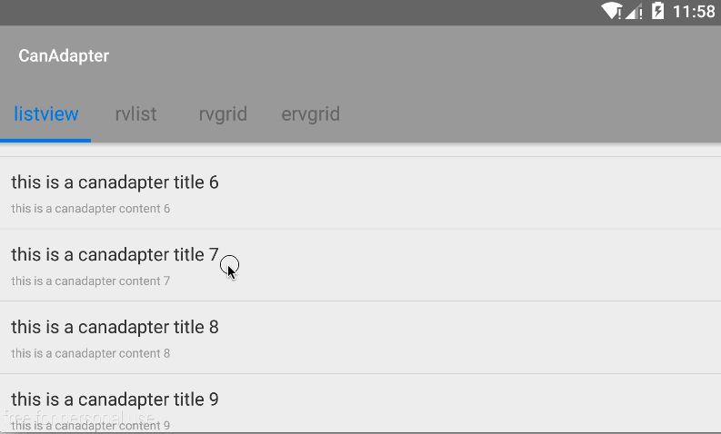

# CanAdapter
一个继承BaseAdapter和RecyclerView.Adapter的库，将Adapter封装成相同的方法，方便使用。


  

##添加依赖
```JAVA
compile 'com.github.canyinghao:CanAdapter:5.0.3'
```

## 使用方式 
**1. CanAdapter介绍**  
ListView使用CanAdapter，RecyclerView使用CanRVAdapter，主要重写它们的三个方法，构造函数、setView、setItemListener这三个。setItemListener的目的是让事件可以在activity中处理，方便adapter的重用。使用adapter.setOnItemListener就可以在activity中处理事件，总共5个事件，onItemChildClick、onItemChildLongClick、onItemChildCheckedChanged、onRVItemClick、onRVItemLongClick。


**2. ListView 使用CanAdapter**  
```JAVA
public class ListViewFragment extends Fragment {
    ListView listView;


    @Nullable
    @Override
    public View onCreateView(LayoutInflater inflater, ViewGroup container, Bundle savedInstanceState) {

        listView = new ListView(getContext());


        final CanAdapter adapter = new CanAdapter<MainBean>(getContext(), R.layout.item_main) {


            @Override
            protected void setView(CanHolderHelper helper, int position, MainBean model) {
                helper.setText(R.id.tv_title, model.title);
                helper.setText(R.id.tv_content, model.content);

            }

            @Override
            protected void setItemListener(CanHolderHelper helper) {

                helper.setItemChildClickListener(R.id.tv_title);
                helper.setItemChildClickListener(R.id.tv_content);

            }
        };

        listView.setAdapter(adapter);


        adapter.setOnItemListener(new CanOnItemListener() {

            public void onItemChildClick(View view, int position) {

                MainBean bean = (MainBean) adapter.getItem(position);
                switch (view.getId()) {


                    case R.id.tv_title:

                        App.getInstance().show(bean.title);
                        break;

                    case R.id.tv_content:
                        App.getInstance().show(bean.content);
                        break;
                }


            }

        });


        adapter.setList(MainBean.getList());


        return listView;
    }


}
```
**3. RecyclerView 使用CanRVAdapter**  
```JAVA
public class RVListFragment extends Fragment {

    RecyclerView recyclerView;


    @Nullable
    @Override
    public View onCreateView(LayoutInflater inflater, ViewGroup container, Bundle savedInstanceState) {

        recyclerView = new RecyclerView(getContext());

        LinearLayoutManager mLayoutManager = new LinearLayoutManager(getContext(), LinearLayoutManager.VERTICAL, false);
        recyclerView.setLayoutManager(mLayoutManager);

        final CanRVAdapter adapter = new CanRVAdapter<MainBean>(recyclerView, R.layout.item_main) {


            @Override
            protected void setView(CanHolderHelper helper, int position, MainBean model) {
                helper.setText(R.id.tv_title, model.title);
                helper.setText(R.id.tv_content, model.content);

            }

            @Override
            protected void setItemListener(CanHolderHelper helper) {

                helper.setItemChildClickListener(R.id.tv_title);
                helper.setItemChildClickListener(R.id.tv_content);

            }
        };

        recyclerView.setAdapter(adapter);


        adapter.setOnItemListener(new CanOnItemListener() {

            public void onItemChildClick(View view, int position) {

                MainBean bean = (MainBean) adapter.getItem(position);
                switch (view.getId()) {


                    case R.id.tv_title:

                        App.getInstance().show(bean.title);
                        break;

                    case R.id.tv_content:
                        App.getInstance().show(bean.content);
                        break;
                }


            }

        });


        adapter.setList(MainBean.getList());


        return recyclerView;
    }


}
```
**4. 新添加可供RecyclerView使用的CanErvAdapter**  
CanErvAdapter有分组功能，可展开或收起分组，可只允许展开一个，可展开全部不允许收起。LayoutManager提供子项每行的个数，LinearLayoutManager每行一个，GridLayoutManager设置的spanCount为多少就是多少。  
限制以及问题：group可使用的区域的宽度与子项每一项的宽度相同。也就是说，当spanCount为3时，group项的宽度只有屏幕宽度的三分之一。这需要特别注意。

CanRVHFAdapter有分组功能，可以添加头部足部。


### 开发者

 

canyinghao: 

<canyinghao@hotmail.com>  

[新浪微博](http://weibo.com/u/5670978460)

[google+](https://plus.google.com/u/0/109542533436298291853)

### License

    Copyright 2016 canyinghao

    Licensed under the Apache License, Version 2.0 (the "License");
    you may not use this file except in compliance with the License.
    You may obtain a copy of the License at

       http://www.apache.org/licenses/LICENSE-2.0

    Unless required by applicable law or agreed to in writing, software
    distributed under the License is distributed on an "AS IS" BASIS,
    WITHOUT WARRANTIES OR CONDITIONS OF ANY KIND, either express or implied.
    See the License for the specific language governing permissions and
    limitations under the License.
